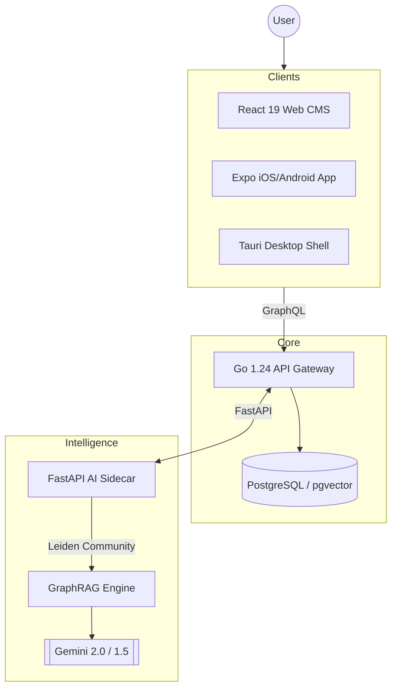

# Ariake

  
  <h1>Ariake</h1>
  
<b>AI Reasoning & Intelligent Archive for Knowledge Ecosystems</b>

  
<i>Ariake is an AI-native scientific knowledge ecosystem for Markdown publishing, GraphRAG reasoning, and cross-platform content delivery.</i>

  
  
  
  
  
  

---

[English](./README.md) | [简体中文](./README.zh.md)

## 🌟 Overview

Ariake is a **scientifically-oriented knowledge ecosystem** that integrates deep AI analysis with cross-platform delivery. It solves the pain points of rendering complex scientific content (KaTeX/Markdown) on mobile and provides an AI-powered **GraphRAG** engine for cross-domain reasoning.

## 🏗️ System Architecture

## 📊 Project Statistics

| Component | Language | Lines of Code | Role |
| :--- | :---: | :---: | :--- |
| **Mobile / Frontend** | TypeScript | ~51,500 | UI & Native Rendering |
| **Backend** | Go | ~42,600 | Logic & Auth |
| **AI Service** | Python | ~31,400 | GraphRAG & Reasoning |
| **Desktop** | Rust | ~230 | Native Desktop Bridge |
| **Total** | **4 Languages** | **~130,000** | **Full-Stack Ecosystem** |

## ✨ Feature Matrix

| Feature | Mobile | Web | Desktop | AI |
| :--- | :---: | :---: | :---: | :---: |
| High-Fidelity Markdown | ✅ | ✅ | ✅ | - |
| KaTeX Scientific Math | ✅ | ✅ | ✅ | - |
| GraphRAG Search | ✅ | ✅ | ✅ | ✅ |
| Offline Draft Storage | ✅ | 🚧 | ✅ | - |
| Mechanism Trees (DRR) | - | ✅ | ✅ | ✅ |

## 🚀 Quick Start

### Prerequisites
- **Node.js**: v22+ & **pnpm**: v10+
- **Go**: v1.24+
- **Python**: v3.12+ (uv recommended)
- **Rust**: v1.75+ (for Desktop builds)

### Development
1. **Install dependencies**: `pnpm install`
2. **Setup environment**: Copy `.env.example` to `.env` in sub-apps.
3. **Run all services**: `pnpm dev`

---
Built with ❤️ for the next generation of knowledge sharing.
