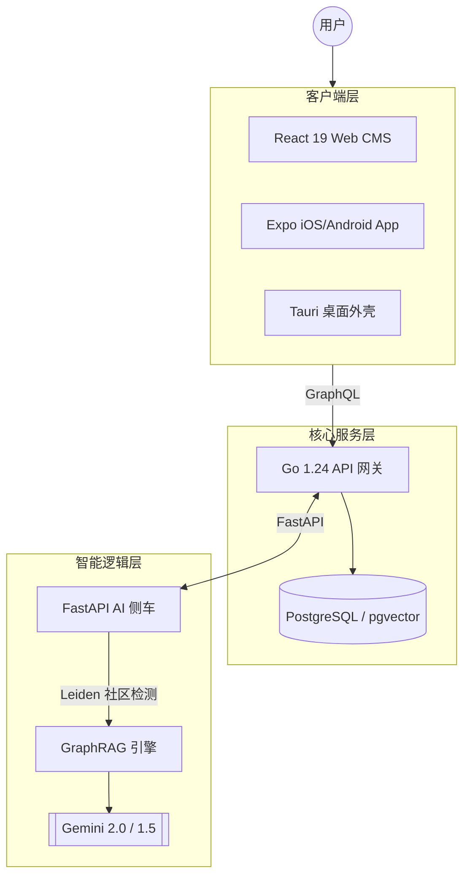

# Ariake

  
  <h1>Ariake</h1>
  
<b>AI Reasoning & Intelligent Archive for Knowledge Ecosystems</b>

  
<i>Ariake 是一个面向科学 Markdown 发布、GraphRAG 推理与跨平台内容交付的 AI 原生知识生态系统。</i>

  
  
  
  
  

---

[English](./README.md) | [简体中文](./README.zh.md)

## 🌟 项目概览

Ariake 是一个**面向科学的知识生态系统**，集成了深度 AI 分析与跨平台分发。它解决了移动端渲染复杂科学内容（KaTeX/Markdown）的痛点，并提供了一个基于 AI 驱动的 **GraphRAG** 引擎，用于跨领域推理。

## 🏗️ 系统架构

## 📊 项目统计

| 组件 | 语言 | 代码行数 | 角色 |
| :--- | :---: | :---: | :--- |
| **移动端 / 前端** | TypeScript | ~51,500 | UI 与 原生渲染 |
| **后端服务** | Go | ~42,600 | 核心逻辑与认证 |
| **AI 服务** | Python | ~31,400 | GraphRAG 与 推理 |
| **桌面端** | Rust | ~230 | 原生桌面桥接 |
| **总计** | **4 种编程语言** | **~130,000** | **全栈闭环生态** |

## ✨ 功能矩阵

| 功能特性 | 移动端 | Web 端 | 桌面端 | AI 服务 |
| :--- | :---: | :---: | :---: | :---: |
| 高保真 Markdown 渲染 | ✅ | ✅ | ✅ | - |
| KaTeX 科学公式 | ✅ | ✅ | ✅ | - |
| GraphRAG 全局搜索 | ✅ | ✅ | ✅ | ✅ |
| 离线草稿存储 | ✅ | 🚧 | ✅ | - |
| 机制树生成 (DRR) | - | ✅ | ✅ | ✅ |

## 🚀 快速开始

### 前置条件
- **Node.js**: v22+ & **pnpm**: v10+
- **Go**: v1.24+
- **Python**: v3.12+ (建议使用 uv)
- **Rust**: v1.75+ (仅桌面端构建需要)

### 开发流程
1. **安装依赖**: `pnpm install`
2. **环境配置**: 将子目录下的 `.env.example` 复制为 `.env`。
3. **启动服务**: `pnpm dev`

---
为下一代知识分享而生。
