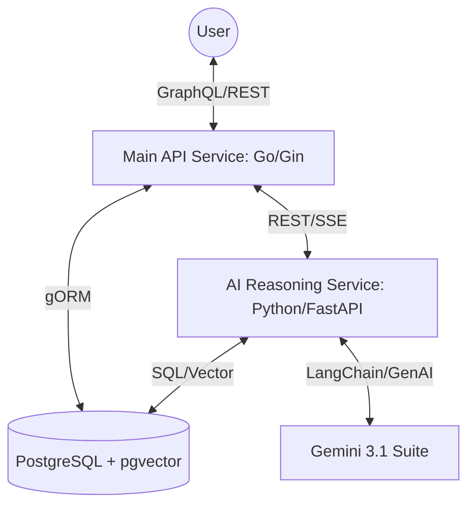

# DRR Framework: Backend Technical Architecture

## 1. Overview
The DRR (Tree-Graph Dual Representation Reasoning) backend is a distributed, heterogeneous system designed to balance high-concurrency web traffic with intensive AI reasoning tasks. It consists of two primary services:
1.  **Main API Service (Go)**: Handles user requests, persistence, and business logic.
2.  **AI Reasoning Service (Python)**: Executes the DRR framework, GraphRAG, and multi-agent coordination.

---

## 2. Distributed Synergy Architecture

### 2.1 Main API Service (Go/Gin)
-   **Role**: The entry point for all client requests.
-   **Core Technologies**: Gin Web Framework, gqlgen (GraphQL), Gorm (ORM).
-   **Key Features**:
    -   **Concurrency**: Leverages Goroutines for non-blocking I/O and task dispatching.
    -   **GraphQL Schema**: Centrally defines the data model for the frontend.
    -   **Session & Auth**: JWT-based authentication middleware.

### 2.2 AI Reasoning Service (Python/FastAPI)
-   **Role**: Executes the computationally expensive DRR logic.
-   **Core Technologies**: FastAPI, Pydantic, httpx, Google-GenAI.
-   **Key Features**:
    -   **Mechanism Tree Engine**: Implements the recursive decomposition of biological adaptations into structural/functional nodes.
    -   **GraphRAG Global Search**: Performs Leiden-clustered community search for global context.
    -   **Asymmetric Compute**: Uses `flash-lite` for routing/drafting and `pro` for auditing/critique.

---

## 3. Communication Patterns

### 3.1 Synchronous GraphQL
Used for standard CRUD operations (creating posts, updating users). The Go server interacts directly with Postgres.

### 3.2 Asynchronous & Streaming (SSE)
For AI-driven global search, the Go server proxies the request to the Python service. 
-   **SSE (Server-Sent Events)**: The Python service streams the reasoning process (`<thinking>`, `<diagnosis>`) back to the Go server, which then forward it to the React frontend.
-   **RRF (Reciprocal Rank Fusion)**: Python service performs hybrid search weighting between Mechanism Tree nodes and GraphRAG global insights.

---

## 4. API Endpoints (AI Service)

| Method | Endpoint | Description | Payload |
| :--- | :--- | :--- | :--- |
| POST | `/global_search` | Blocking global search request | `{ "query": "...", "active_ingredients": [...] }` |
| GET | `/global_search_stream` | Streaming global search via SSE | `?query=...` |
| POST | `/benchmark` | Execute the 10-domain benchmark suite | N/A |

---

## 5. Security & Scaling
-   **Environment Isolation**: Sensitive keys (DB_URL, GEMINI_API_KEY) are managed via `.env` files.
-   **Horizontal Scaling**: The AI service is stateless and can be scaled independently of the main API to handle peak reasoning loads.
