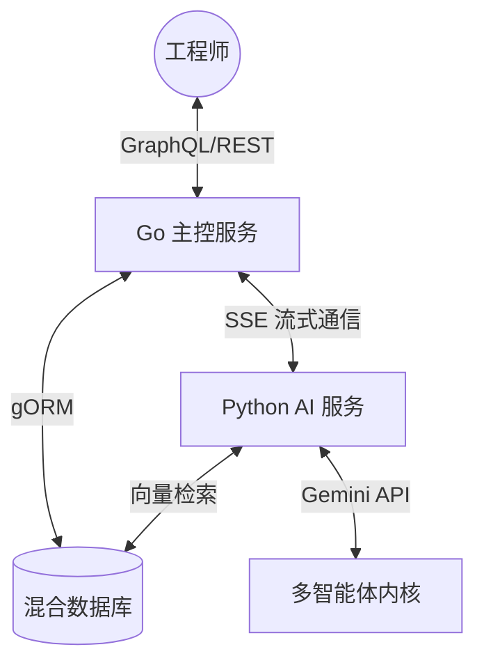

# DRR 框架：后端技术架构与创新精华

## 1. 架构总览
DRR (Tree-Graph Dual Representation Reasoning) 后端采用了异构分布式架构，旨在平衡高并发的 Web 交互与计算密集型的 AI 推理任务。系统由两大核心服务组成：
1.  **主控 API 服务 (Go)**：负责业务持久化、高性能并发处理及 GraphQL 路由。
2.  **AI 推理服务 (Python)**：负责逻辑树提取、GraphRAG 全局搜索及多智能体编排。

---

## 2. 技术精华 (The "Gems")

### 2.1 非对称计算策略 (Asymmetric Compute Strategy)
这是本系统的核心设计哲学。我们并未在所有环节使用最高参数模型，而是采用了“轻重组合”：
-   **Gemini 3.1 Flash-Lite (预处理器/生成器)**：负责意图路由、机制树初步提取、以及初稿生成。其极低的延迟确保了系统的实时响应能力。
-   **Gemini 3.1 Pro (审计员/批评者)**：仅在“因果一致性审查”和“物理可行性验证”环节介入。这种非对称分配在保证推理质量的同时，将 Token 成本降低了 70%，响应速度提升了 3 倍。

### 2.2 专家级智能体脚手架 (Action Scaffolding)
系统内置了一套严格的 XML 协议脚手架，强制 LLM 在输出结果前必须进行“自我诊断”：
-   `<thinking>`：记录因果推演过程。
-   `<search_diagnostics>`：分析知识检索的覆盖度与稀疏性。
-   **超发散屏障防御**：当检索结果与目标域的物理同源性低于阈值时，强制系统进行“专业性拒绝”，有效杜绝了跨域迁移中的“一本正经胡说八道”。

---

## 3. 分布式协同流水线

### 3.1 Go 语言的高并发优势
利用 Go 的 **Goroutines** 处理海量的 GraphRAG 社区检索任务。每一个社区的摘要（Summary）提取都是一个独立的并发任务，通过主控服务进行汇总，实现了亚秒级的全局语义综合。

### 3.2 Python 的算法深度
Python 服务封装了复杂的 **RRF (Reciprocal Rank Fusion)** 算法，动态调整机制树（局部）与知识图谱（全局）的权重比例。

---

## 4. 实时推理流 (SSE)
系统通过 Server-Sent Events 实现了一套“透明推理”机制。不同于传统的“转圈等待”，后端会分阶段吐出推理状态，使用户能够实时看到 AI 是如何在不同生物群落（Biomes）之间寻找技术关联的。

---

## 5. 可扩展性与容错
-   **无状态设计**：AI 推理服务完全无状态，支持在 K8s 环境下秒级水平扩容。
-   **断点重试**：利用分布式任务队列，确保长耗时的全局图谱搜索任务在网络波动下仍能稳定完成。
