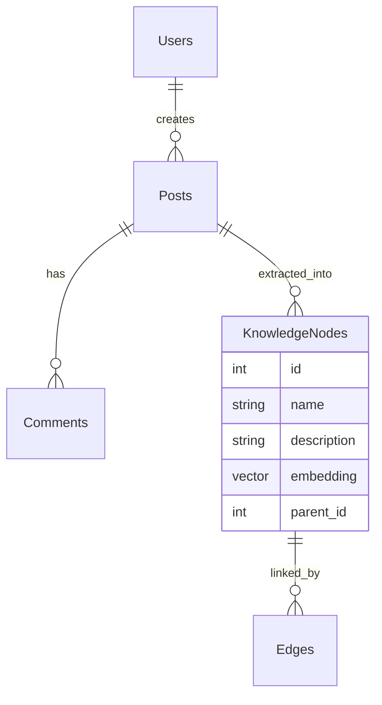

# DRR Framework: Database Technical Specification

## 1. Overview
The DRR (Tree-Graph Dual Representation Reasoning) database uses **PostgreSQL** with the **pgvector** extension. This hybrid approach enables the system to store traditional relational data, hierarchical biological mechanism trees, and high-dimensional semantic embeddings in a single, unified backend.

---

## 2. Hybrid Persistence Strategy



### 2.1 Relational Storage (Postgres Standard)
-   **Users & Posts**: Stores user metadata, article content, and version history.
-   **Comments**: Stores user feedback and peer-review threads for the academic discovery process.

### 2.2 Semantic Storage (pgvector)
-   **KnowledgeNodes**: Stores biological adaptations, mechanisms, and physical principles.
-   **Vector Column**: Each node contains a `1536-dimensional` vector (derived from Gemini embeddings) for RAG-based similarity search.
-   **Indexing**: Uses **HNSW (Hierarchical Navigable Small World)** indexing for high-speed, sub-second vector lookups.

---

## 3. GraphRAG Topology & Communities
The system integrates **Leiden community clustering** at the database layer.

-   **Edges Table**: Captures relationships between biological entities (e.g., `SYMBIOSIS`, `PREDATION`, `STRUCTURAL_ANALOGY`).
-   **Communities View**: A virtual materialized view that groups nodes into thematic biological "Neighborhoods" (e.g., "Arid Plant Physiology", "Aquatic Hydrodynamics").

---

## 4. Performance Optimization: Recursive CTEs
One of the key technical differentiators of the DRR framework is the use of **Recursive Common Table Expressions (CTEs)** to extract deep mechanism trees.

-   **The Challenge**: Biological adaptations are often infinitely nested (e.g., Wing -> Feather -> Setae -> Nano-grooves).
-   **The Solution**: A recursive SQL query that traverses the `parent_id` hierarchy in a single I/O operation, returning a fully reconstructed mechanism tree.

```sql
WITH RECURSIVE mechanism_path AS (
    SELECT id, parent_id, name, 1 as level
    FROM knowledge_nodes WHERE id = $root_id
    UNION ALL
    SELECT n.id, n.parent_id, n.name, mp.level + 1
    FROM knowledge_nodes n
    JOIN mechanism_path mp ON n.parent_id = mp.id
)
SELECT * FROM mechanism_path ORDER BY level;
```

---

## 5. Scalability & Maintenance
-   **Vacuuming & Index Rebuilding**: Automated maintenance tasks to ensure pgvector HNSW indices remain performant as the knowledge graph grows.
-   **Sharding (Future)**: The schema is designed to support horizontal sharding by community ID for large-scale biological datasets.
