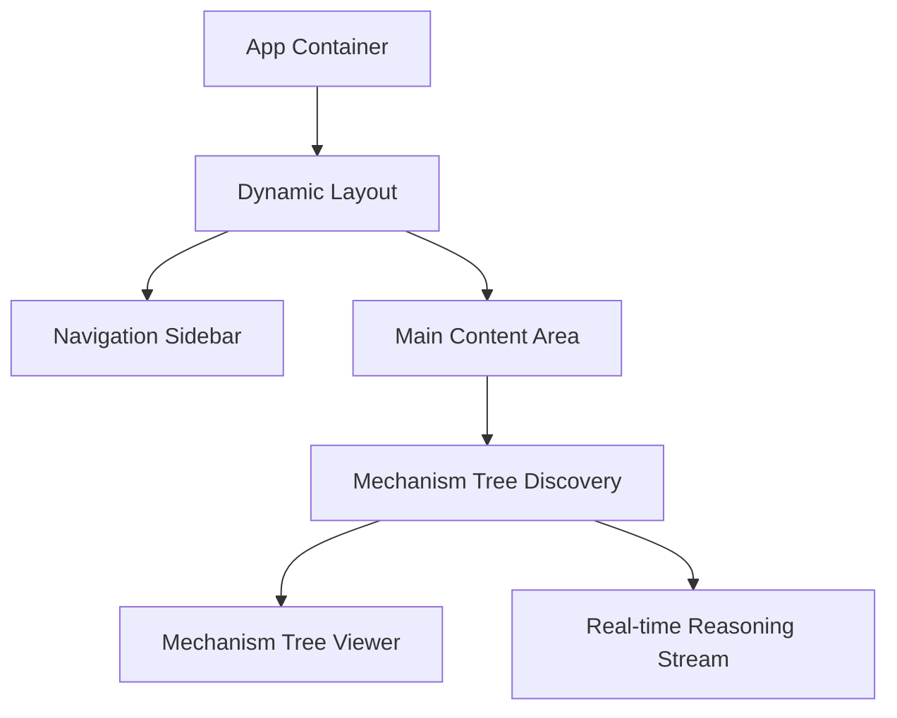

# DRR Framework: Frontend Technical Design

## 1. Overview
The DRR (Tree-Graph Dual Representation Reasoning) frontend is a modern, responsive web application built to provide engineers with a clear, interactive interface for cross-domain mechanism discovery. It leverages **React 19** and **Vite** for the core framework, with **Ant Design 5** for UI components and **Tailwind 4** for styling.

---

## 2. Frontend Technology Stack

| Layer | Technology |
| :--- | :--- |
| **Framework** | React 19 (Hooks, Functional Components) |
| **Build Tool** | Vite |
| **State Management** | Apollo Client (GraphQL) + Local React State |
| **Styling** | Tailwind CSS 4 + Ant Design 5 |
| **Visualization** | Mermaid.js + Lottie (Optimized) |

---

## 3. Core Component Architecture

### 3.1 Mechanism Tree Viewer
-   **Role**: Visualizes the hierarchical decomposition of transferable source-domain mechanisms.
-   **Implementation**: Uses a recursive component pattern to render nested mechanism nodes.
-   **Interactivity**: Supports "Drill-down" actions, allowing users to trace a mechanism from a high-level function to a specific physical constant.

### 3.2 Real-time Reasoning Stream
-   **Role**: Reduces the "Black-Box" perceived by users when interacting with deep AI reasoning.
-   **Implementation**: Utilizes Server-Sent Events (SSE) to display incremental updates:
    -   **<thinking>**: Displays the model's internal causal reasoning.
    -   **<search_diagnostics>**: Explains which parts of the knowledge graph were queried.
    -   **<final_insight>**: Presents the synthesized engineering recommendation.

---

## 4. GraphQL Integration (Apollo Client)
The frontend uses Apollo Client to interact with the Go backend's GraphQL API. 

-   **Queries**: Fetching post content, mechanism metadata, and user history.
-   **Mutations**: Submit new engineering queries, trigger background AI processing.
-   **Streaming**: Some endpoints utilize GraphQL Subscriptions or SSE proxies for real-time status updates.

---

## 5. UI/UX Optimization
-   **Glassmorphism & Dark Mode**: A premium, high-tech aesthetic to match the "Advanced AI" theme.
-   **Responsive Layout**: Optimized for both high-resolution engineering workstations and mobile devices.
-   **Accessibility**: Full compliance with WAI-ARIA standards for inclusive design.
